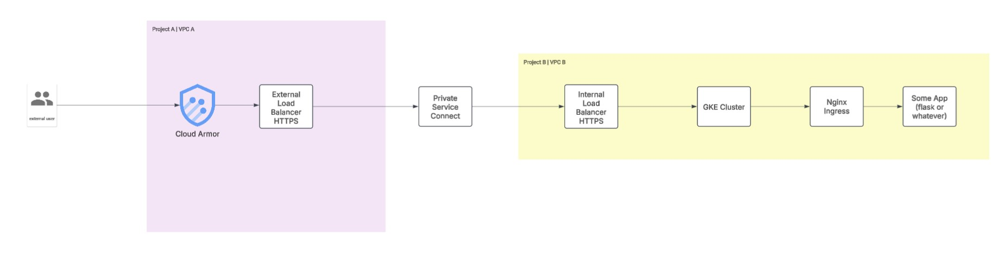
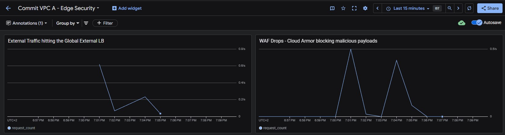
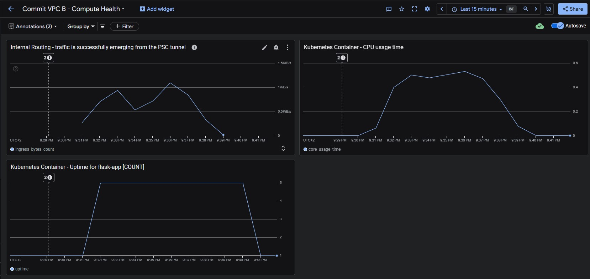
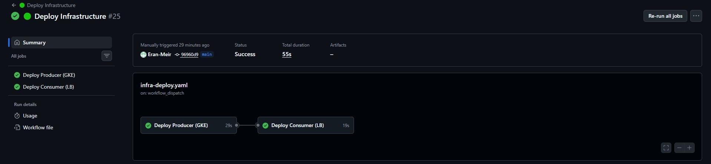
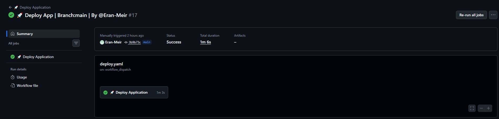
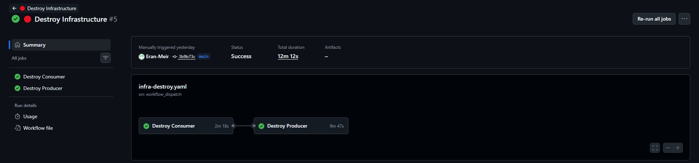

# Secure Cross-Project GCP Architecture & GitOps Pipeline

This repository provisions a highly secure, end-to-end encrypted infrastructure on Google Cloud Platform. It demonstrates advanced cross-project networking, zero-trust perimeter security, and a fully automated GitOps deployment lifecycle.



## 🏗️ Architecture Overview

The architecture completely isolates the public-facing ingestion layer from the private compute backend using **Google Cloud Private Service Connect (PSC)**. This eliminates the need for VPC Peering and prevents overlapping IP complexities.

### Key Components:
1. **VPC A (The Consumer/Edge):** Acts as a DMZ. Catches public internet traffic, terminates the initial TLS connection, and scrubs requests via Cloud Armor (WAF).
2. **Private Service Connect (The Bridge):** A secure, unidirectional tunnel across Google's internal backbone linking VPC A to VPC B without exposing the backend to the public internet.
3. **VPC B (The Producer/Compute):** A strictly private network hosting the GKE cluster. Contains an Internal TCP Load Balancer that passes traffic directly to GKE nodes.
4. **GKE & Ingress:** Nginx is deployed with `hostNetwork: true` to bind directly to the node's port 443, re-encrypting and terminating TLS completely inside the internal boundary before routing to the Flask application.

## 🚦 Traffic Flow (The Journey of a Request)

1. **User Request:** An external user sends an HTTPS `GET` request to the Global External IP.
2. **WAF Inspection:** Cloud Armor evaluates the request at the edge, blocking malicious payloads (e.g., SQLi, XSS).
3. **External TLS Termination:** The Global External HTTP(S) Load Balancer decrypts the traffic using an edge certificate.
4. **PSC Encapsulation:** Traffic is routed to a Network Endpoint Group (NEG) and tunneled through Private Service Connect.
5. **Internal Routing:** Traffic emerges in the Producer VPC via a Service Attachment and hits an Internal TCP Passthrough Load Balancer on port 443.
6. **Internal TLS Termination:** The traffic hits Nginx Ingress on the GKE node, which uses an internal certificate to decrypt the traffic safely inside the cluster.
7. **Application Execution:** Nginx proxies the plaintext request to the custom Flask API pod running on port 8080, which returns the payload.

## 📈 Elastic Scaling & High Availability

The platform features a **Horizontal Pod Autoscaler (HPA)** designed to handle volatile traffic patterns through intensive CPU-bound workloads.

### Automated Load Response:
To demonstrate real-world elasticity, the Flask application includes a dedicated `/hpa` endpoint that performs heavy floating-point computations. 

* **Rapid Scale-Out:** As demonstrated in the monitoring data, a sustained CPU spike triggers the HPA to scale the deployment from **1 to 5 pods in less than 60 seconds**.
* **Aggressive Scale-Down:** To optimize cloud costs, a custom `behavior` policy is applied, forcing the cluster to scale back down to the baseline within 60 seconds of load cessation, rather than the Kubernetes default of 5 minutes.
* **The Test Command:** To trigger a scale event, you can run the following loop in a terminal (Git Bash or Linux) to sustain high CPU utilization:
  ```bash
  while true; do curl -k -s https://<YOUR_GLOBAL_IP>/hpa & sleep 1; done

## 📊 Observability as Code

Monitoring is strictly decoupled by network boundary and managed entirely via Terraform to ensure the observability layer shares the exact lifecycle as the compute infrastructure.

### VPC A: Edge Security
Tracks external ingress and WAF drop rates to monitor perimeter health.


### VPC B: Compute Health & Scaling
Correlates Layer 3/Layer 4 bytes emerging from the PSC tunnel directly with Kubernetes Pod CPU utilization and live Pod counts (Uptime).


## 🚀 GitOps Deployment Workflow

Infrastructure and Application deployments are cleanly separated in GitHub Actions. 

1. **`infra-deploy.yml` (Manual Trigger):**
   * **Job 1 (Producer):** Deploys VPC B, NAT, GKE Cluster, PSC Service Attachment, and the Compute Monitoring Dashboard via Terraform.
   * **Job 2 (Consumer):** Deploys VPC A, Global LB, Cloud Armor WAF, PSC NEG, and the Edge Monitoring Dashboard via Terraform.
   

   
2. **`deploy.yml` (Manual Trigger):**
   * Authenticates to Google Cloud.
   * Builds the lightweight Flask Docker image from `app/Dockerfile`.
   * Pushes the image to Google Artifact Registry.
   * Applies Kubernetes manifests (`nginx-ingress.yaml`, `flask-app.yaml`, `hpa.yaml`) to the GKE cluster.
   


## 🧹 Teardown (Automated Destroy)

To prevent ongoing cloud costs, this entire environment is strictly disposable and its destruction is fully automated via GitHub Actions.

**`infra-destroy.yml` (Manual Trigger):**
* **Job 1 (Destroy Consumer):** Tears down the Edge infrastructure first (Cloud Armor, Global LB, NEG). This safely detaches the Private Service Connect tunnel.
* **Job 2 (Destroy Producer):** Tears down the backend infrastructure (GKE, Artifact Registry, Service Attachment).



### Fallback Manual Teardown
If executing locally without GitHub Actions, ensure you destroy the Consumer environment before the Producer to prevent hanging PSC attachments:
```bash
# 1. Destroy Consumer (Edge) first to detach the PSC tunnel
cd terraform/consumer && terraform destroy -auto-approve

# 2. Destroy Producer (Compute) 
cd terraform/producer && terraform destroy -auto-approve
```
## 🔮 Future Production Enhancements

While this repository provisions a cost-effective **Zonal GKE Cluster** to optimize for fast GitOps pipeline execution and minimal cloud spend, a true enterprise production rollout would expand on this foundation with the following enhancements:

* **High Availability (Regional Cluster):** Upgrading the GKE control plane to a Regional cluster spanning multiple compute zones (e.g., `me-west1-a`, `me-west1-b`, `me-west1-c`) to ensure the platform can survive isolated data center outages.
* **Elastic Compute (Cluster Autoscaler):** The current architecture demonstrates the **Horizontal Pod Autoscaler (HPA)** scaling *Pods* based on CPU utilization within a fixed physical boundary. For true elasticity, enabling the **Cluster Autoscaler (CA)** would allow GKE to dynamically provision and destroy the underlying Compute Engine VMs across multiple zones whenever the HPA requests pods that exceed the current node capacity.
